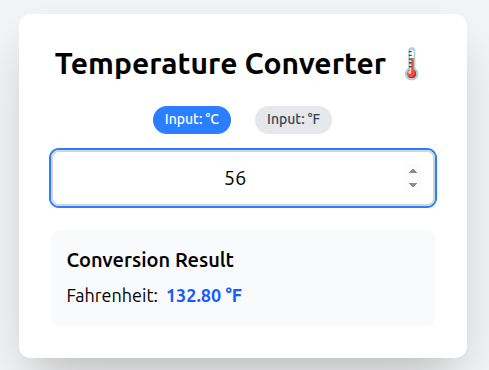

# 🌡️ React Temperature Converter

A responsive, two-way temperature conversion application built with **React** and **Tailwind CSS**.
This project demonstrates fundamental React concepts including state management, controlled components, and conditional rendering.

---

## ✨ Features

- **Two-Way Conversion**: Seamlessly convert between Celsius (°C) and Fahrenheit (°F).
- **Real-Time Calculation**: Results update instantly as you type.
- **Input Validation**: Visual error feedback and validation for non-numeric inputs.
- **Clean UI**: Modern, responsive design using Tailwind CSS and Lucide icons.
- **Unit Toggling**: One-click switching between input units with automatic state clearing.

---

## 🚀 Getting Started

Follow these steps to run the project locally.

### **Prerequisites**

- Node.js installed on your machine.

### **Installation**

#### 1. Clone the repository

```bash
git clone https://github.com/CioFlingar/react-Temp-Toggle.git
cd react-temp-toggle
```

#### 2. Install dependencies

```bash
npm install
```

#### 3. Start the development server

```bash
npm run dev
```

### Open in Browser

Visit:
👉 http://localhost:5173

## 🛠️ Technology Stack

- **Framework**: React (Vite Template)

- **Styling**: Tailwind CSS

- **Icons**: Lucide React

## 🧠 Concepts Learned

This project demonstrates:

- **useState Hook**: Managing multiple state variables (temperature, unit, error).

- **Controlled Components**: Input fields fully synced with React state.

- **Derived State**: Computing converted values dynamically without extra state variables.

- **Conditional Rendering**: Showing error messages and updating labels based on app state.

## 📸 Screenshots



## 🤝 Contributing

#### Contributions are welcome!

Feel free to open an issue or submit a pull request for improvements, bug fixes, or new features.

## 📄 License

This project is open-source.

## Author

- **Walid Hasan**
- **Email:** [eng.walidhasan@gmail.com](eng.walidhasan@gmail.com)
- **LinkedIn:** [linkedin.com/in/walid-hasan-](linkedin.com/in/walid-hasan-/)
